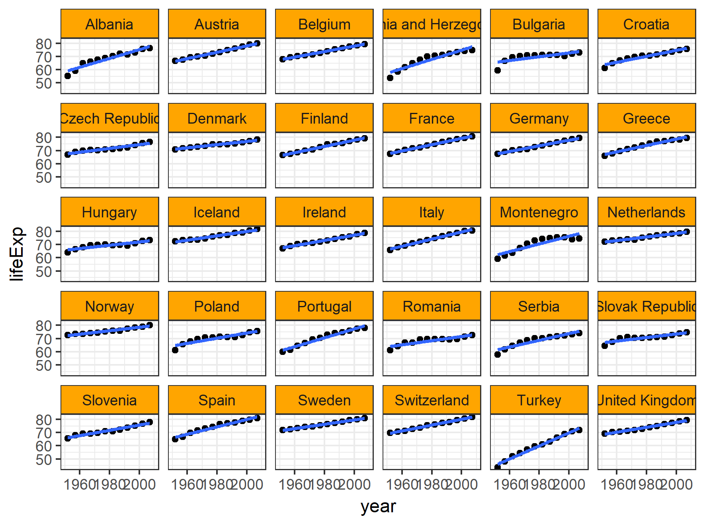

# Homework 07

There are **MANY** files here, the .Rmd and the .pdf of the homework assigment are here:
* [R Markdown](https://github.com/Mathnstein/STAT545-hw-griffith-cody/tree/master/HW07)
* [PDF](https://github.com/Mathnstein/STAT545-hw-griffith-cody/blob/master/HW07/Hw_07.pdf)

Here is the explanation of the pipeline for the gapminder dataset

First script: download some data: [00_downloader.R](https://github.com/Mathnstein/STAT545-hw-griffith-cody/blob/master/HW07/00_downloader.R). This will store the data here [gapminder.tsv](https://github.com/Mathnstein/STAT545-hw-griffith-cody/blob/master/HW07/gapminder.tsv)

Second script: read the data, order it, make a few plots from the data, write out an ordered file [01_exploratory.R](https://github.com/Mathnstein/STAT545-hw-griffith-cody/blob/master/HW07/01_exploratory.R), this will produce two images, one image like this [scatterplot_analysis_lifeexp_vs_year.png](https://github.com/Mathnstein/STAT545-hw-griffith-cody/blob/master/HW07/scatterplot_analysis_lifeexp_vs_year.png):

the other is [Scatterplot_totalpop_vs_year.png](https://github.com/Mathnstein/STAT545-hw-griffith-cody/blob/master/HW07/Scatterplot_totalpop_vs_year.png). Then the file will store the ordered data (By continent and then by life expectancy) in [gap_clean.tsv](https://github.com/Mathnstein/STAT545-hw-griffith-cody/blob/master/HW07/gap_clean.tsv)

Third script: Perform statistical analysis and make plots over each continent [02_statistical.R](https://github.com/Mathnstein/STAT545-hw-griffith-cody/blob/master/HW07/02_statistical.R), this will create images like [Europe_counties_lifeexp.png](https://github.com/Mathnstein/STAT545-hw-griffith-cody/blob/master/HW07/Europe_countries_lifeexp.png):

Others will be:

* [Africa_countries_lifeexp.png](https://github.com/Mathnstein/STAT545-hw-griffith-cody/blob/master/HW07/Africa_countries_lifeexp.png)

* [Americas_countries_lifeexp.png](https://github.com/Mathnstein/STAT545-hw-griffith-cody/blob/master/HW07/Americas_countries_lifeexp.png)

* [Asia_countries_lifeexp.png](https://github.com/Mathnstein/STAT545-hw-griffith-cody/blob/master/HW07/Asia_countries_lifeexp.png)

* [Oceania_countries_lifeexp.png](https://github.com/Mathnstein/STAT545-hw-griffith-cody/blob/master/HW07/Oceania_countries_lifeexp.png)

Fourth script: The master file to run this pipeline [master.R](https://github.com/Mathnstein/STAT545-hw-griffith-cody/blob/master/HW07/master.R)

